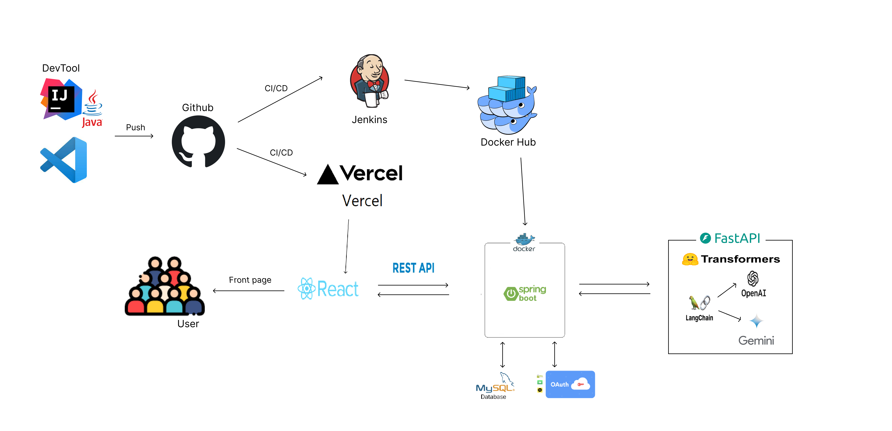

# 오늘은 - Backend
오늘은 Backend는 Java를 사용하여 구현되었습니다. 이 Backend는 Kakao 및 Naver SNS 로그인 기능, 젠킨스 도커 등을 포함하고 있습니다.

## 목차
1. 소개 및 목적
2. 기능
3. 기술 스택
4. 설치 및 실행
5. API 문서
 
 
 
## 소개 및 목적
프로젝트 이름의 Backend는 newsAPI를 활용하여 그 날의 인기 있는 뉴스를 조회하고, 이를 DB에 저장합니다.  
그 후 AI 서버로 해당 뉴스의 본문을 전송하여 가공하고, 가공된 내용을 다시 DB에 저장합니다.  
이후 저장된 내용은 웹과 앱으로 카테고리별로 제공되며, AI로 요약된 그 날의 가장 인기 있는 뉴스 모음과 핫한 키워드 목록을 제공합니다.  
또한 사용자가 SNS 로그인을 통해 엑세스 토큰을 발급받을 수 있으며,   jenkins와 Docker를 사용하여 CI/CD 파이프라인을 구축합니다.

### 동작 방식
1. <b> newsAPI 조회 </b>: 매일 newsAPI를 호출하여 그 날의 인기 있는 뉴스를 가져옵니다.

2. <b>DB 저장</b>: 가져온 뉴스를 데이터베이스에 저장합니다. 뉴스의 제목, 내용, 발행일 등의 정보가 저장됩니다.

3. <b>AI 서버 가공</b>: 저장된 뉴스의 본문을 AI 서버로 전송하여 가공합니다. 가공된 내용은 텍스트 요약, 감정 분석 등의 작업을 통해 뉴스를 보다 이해하기 쉽게 만듭니다.

4. <b>DB에 가공된 내용 저장</b>: AI 서버에서 가공된 뉴스 내용을 받아 DB에 저장합니다. 이는 웹과 앱에서 해당 내용을 소비자에게 제공할 때 사용됩니다.

5. <b>카테고리별 제공</b>: 웹과 앱에서는 사용자가 관심 있는 카테고리별로 가공된 뉴스를 제공합니다. 예를 들어, 정치, 경제, 스포츠 등으로 분류된 뉴스를 볼 수 있습니다.

6. <b>인기 뉴스 모음 및 핫한 키워드 제공</b>: AI로 요약된 그 날의 인기 있는 뉴스 모음과 핫한 키워드 목록을 제공합니다. 이는 사용자가 더 빠르게 핵심적인 뉴스를 파악할 수 있도록 돕습니다.

7. <b>SNS 로그인 및 액세스 토큰 발급</b>: 사용자는 SNS 로그인을 통해 액세스 토큰을 발급받을 수 있습니다.

8. <b>CI/CD 파이프라인 구축</b>: Jenkins와 Docker를 사용하여 CI/CD 파이프라인을 구축합니다. 변경된 코드를 자동으로 빌드, 테스트하고, 통합 및 배포합니다.

## 기능

1. newsAPI 조회 및 저장
- 매일 newsAPI를 호출하여 인기 있는 뉴스를 조회합니다.
- 조회한 뉴스를 데이터베이스에 저장합니다.
2. AI 서버 가공

- 저장된 뉴스의 본문을 AI 서버로 전송하여 가공합니다.
- 가공된 내용을 데이터베이스에 저장합니다.
3. 카테고리별 뉴스 제공

- 사용자가 관심 있는 카테고리별로 가공된 뉴스를 제공합니다.
4. 인기 뉴스 모음 및 핫한 키워드 제공
- AI로 요약된 그 날의 인기 있는 뉴스 모음을 제공합니다.
- 핫한 키워드 목록을 제공하여 사용자가 빠르게 핵심적인 뉴스를 파악할 수 있도록 돕습니다.
5. SNS 로그인 및 액세스 토큰 발급
- 사용자는 SNS 로그인을 통해 액세스 토큰을 발급받을 수 있습니다.
6. CI/CD 파이프라인 구축
- Jenkins와 Docker를 사용하여 CI/CD 파이프라인을 구축합니다.
- 변경된 코드를 자동으로 빌드, 테스트하고, 통합 및 배포합니다.

## 기술 스택
- Java
- Spring Framework
- Spring Boot
- Kakao OAuth
- Naver OAuth
- jenkins
- docker

## 아키텍쳐

 
 

 카카오 로그인

