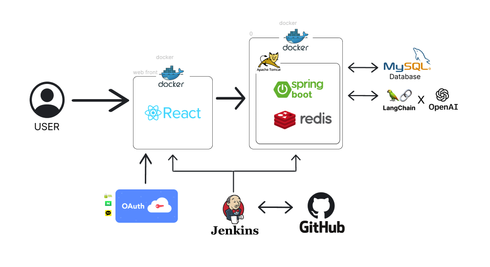

# 오늘은

## 기획 및 의도
- 오늘의 해외 뉴스 정보 , 날씨 등을 종합적으로 볼 수 있는 앱

- 최근 해외 이슈들이 국내 시장에 끼치는 영향이 지속적으로 증가함에 따라, 애플리케이션을 통해 해외의 주요 이슈들을 손쉽게 확인할 수 있도록 제작

- 카테고리 별 인기 기사를 제공하여 특정 분야의 이슈를 확인할 수 있음

- 전체 기사 중 가장 이슈가 높은 기사를 요약하여 제공하여, 전체 이슈를 한 눈에 확인할 수 있음

## 시장 조사
- 국내 뉴스 기사들을 요약하고 제공하는 앱, 웹은 많지만, 해외 기사를 쉽게 볼 수 있게 제공하는 어플리케이션은 부족함.

## 사용 기술
- React
- React Native
- Spring
- MySQL
- JPA
- Jenkins
- Docker
- DNS
- SSL
- Open AI
- LangChain
- Redis

## 프로젝트 아키텍쳐

